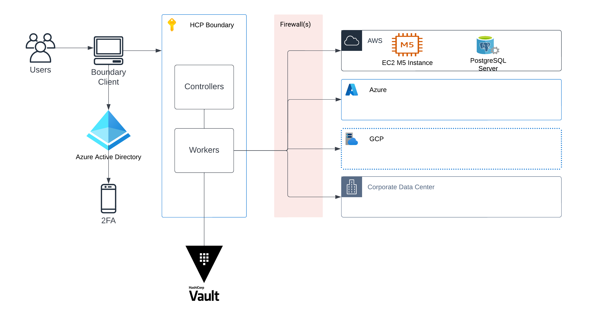

# multicloud-pam-hcp-boundary

## Summary

The purpose of this project is to demonstrate HCP Boundary's ability to securely connect to resources (VMs, databases, containers, network devices, etc.) across multiple clouds (AWS, Azure, GCP and on-prem).

## Overview Diagram

## Setup
Install Terraform >v1.0

rename "terraform.tfvars.example" file to "terraform.tfvars"

populate "terraform.tfvars" files with appropriate variables

terraform init

terraform plan

terraform apply

rename .tfdummy files to .tf

terraform plan/apply

## Help Authenticating with gcloud

1) brew install --cask google-cloud-sdk

2) gcloud init

3) gcloud config set compute/zone us-central1-a
